 

  <picture>
    <source
    srcset="./assets/images/logo3.png"
    media="(prefers-color-scheme: dark)"
    width="150" height="150"
    />
    
  </picture>
  <h1 align="center">Hotel De Luna</h1>

A dynamic hotel management application for a hotel group using flutter and firebase as a part of a college group project!

## Table of Contents

* [Description](#Description)
* [Screens](#Screens)
  * [Onboarding Screens](#onboarding-screens)
  * [Hotel Booking Screens](#hotel-booking-screens)
  * [Employee Screens](#employee-screens)
  * [Side navbar](#side-navbar)
  * [Analytics](#analytics)
* [Database Schema](#database-schema)

## Description

The Hotel Management Application is a mobile booking application that was created with the
use of Flutter. The application was created for a made-up chain of high-end resort hotels, Hotel De Luna.
The app was created with the primary objective of customers making sure they book directly
instead of confirming their bookings through third-party websites. By promoting direct bookings,
the application helps the hotel offer better pricing, customer data and overall service quality.
This also helps build customer loyalty and provides convenience for them. The application has
two parts: **User login & Employee login**.

The system allows an employee to:

* Log in to their personal employee accounts.
* View assigned tasks and track their progress.
* The list view lets the employee verify the tasks they have completed.
* Employees have different permissions:none,some,all
* Employees that have all permissions can manage the other employees and view all their
tasks.

The system allows the customer to:
* Sign up and create an account within the Hotel De Luna application.
* Take a look at all the locations of hotels and select their preferred destination.
* Use the filtering options that allows a user to find a hotel based on their price range,
ratings, the check-in/check-out dates and desired amenities they want.
* Book a room.
* Process payments and confirm the booking.

## Screens

### Onboarding Screens

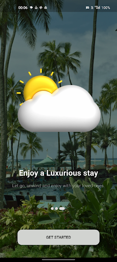
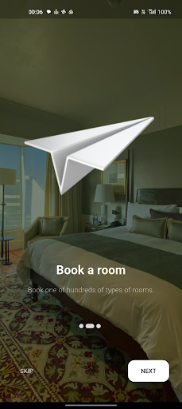
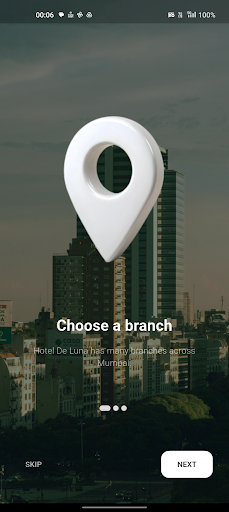

### Hotel Booking Screens

<h5>Homescreen</h5>
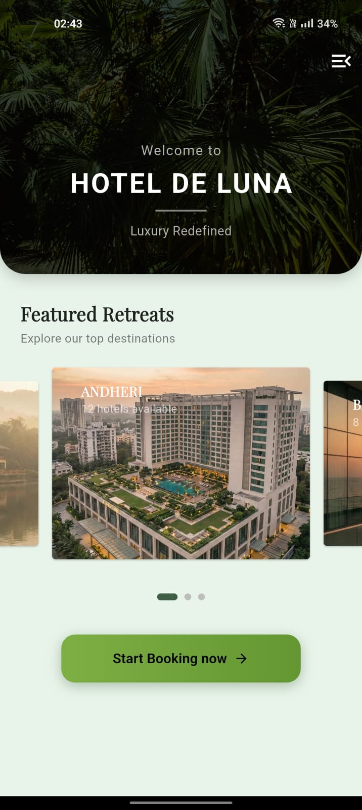

<h5>Explore page</h5>
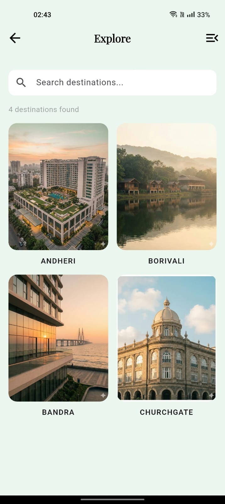

<h5>Filtering pages</h5>
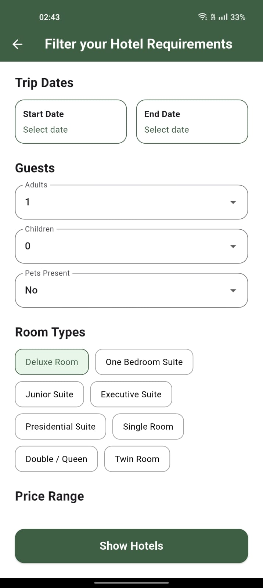
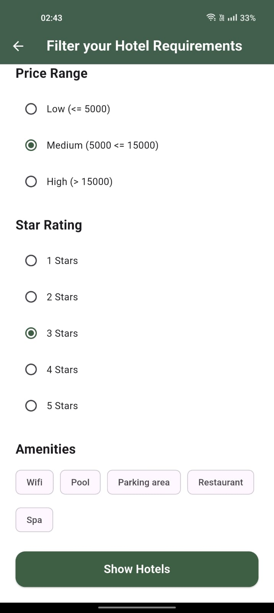

<h5>Result page</h5>
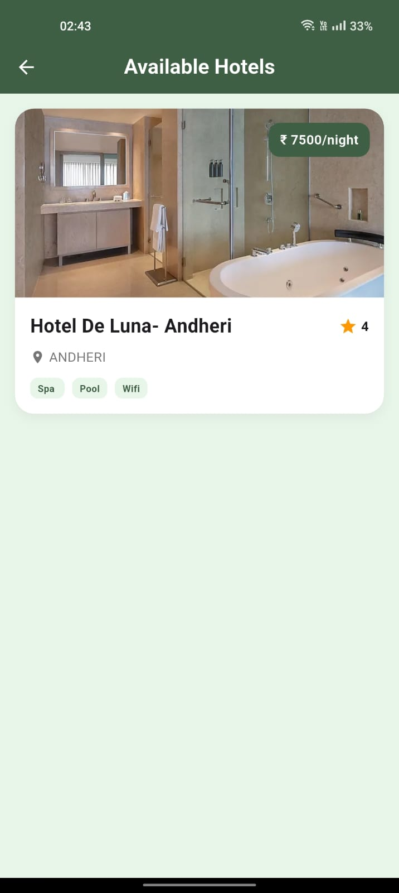

<h5>Hotel Info Screen</h5>
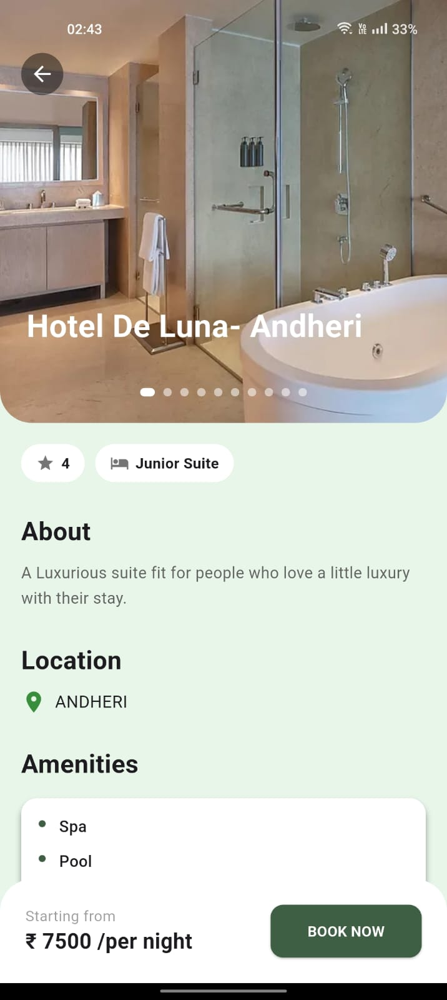
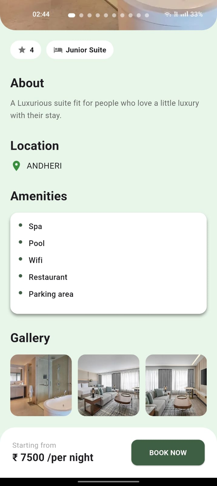

<h5>Payment Screens</h5>
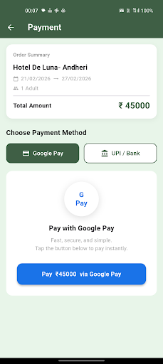
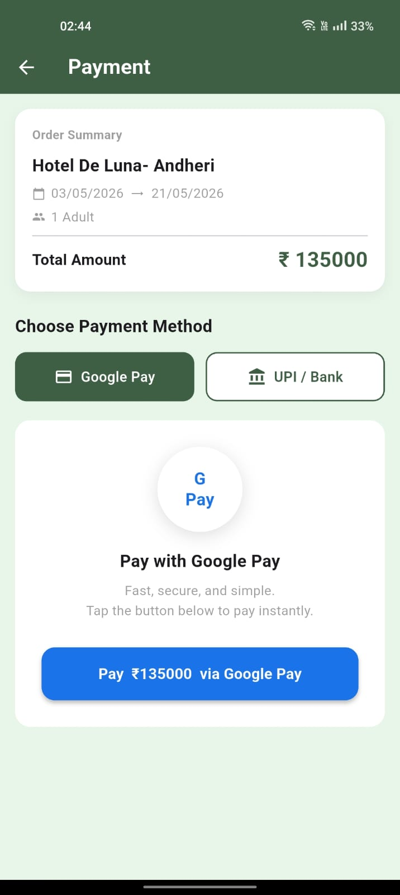
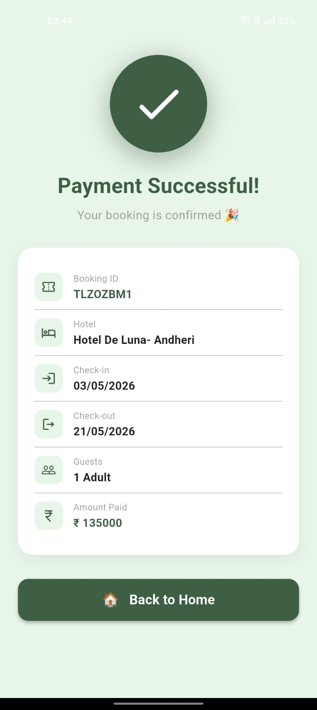

### Employee Screens

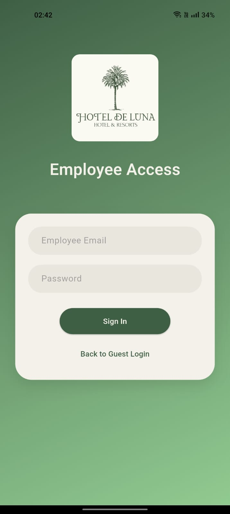
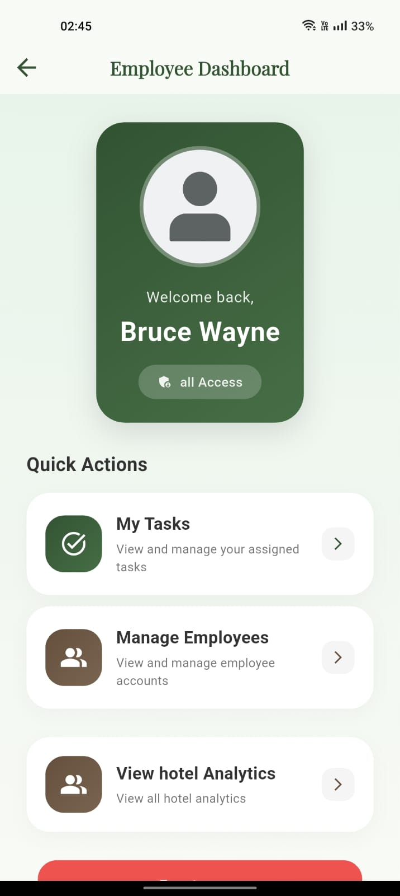
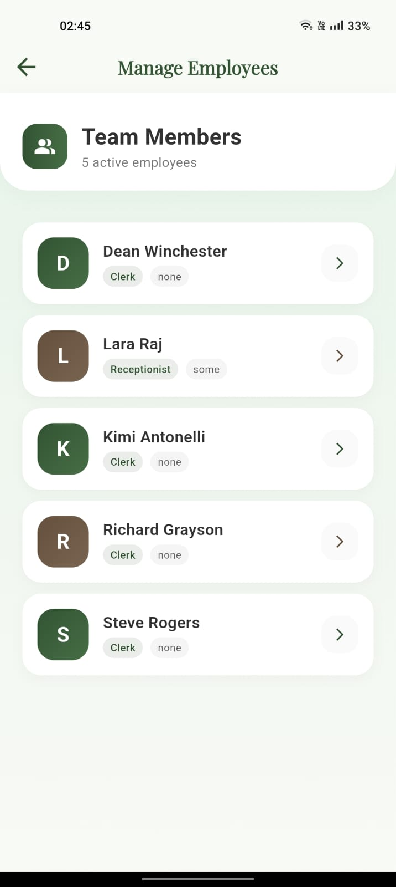         
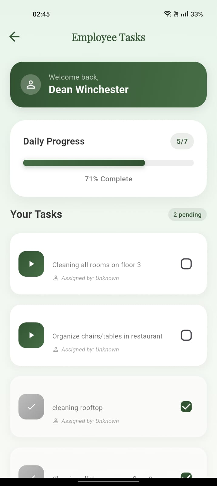

### Side navbar

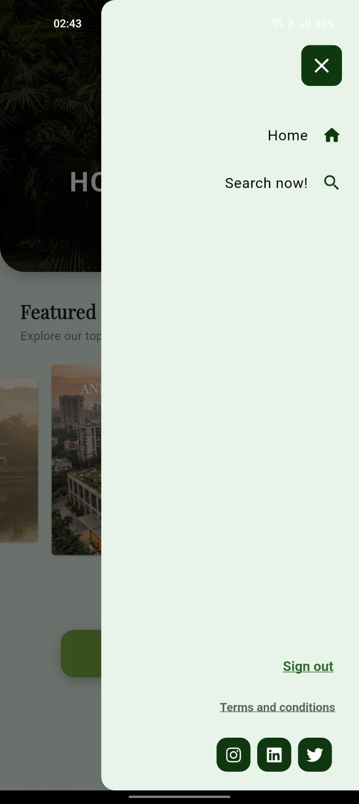 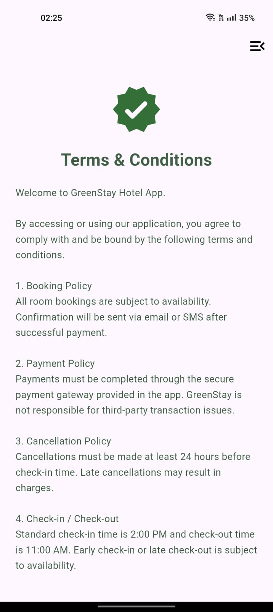

### Analytics

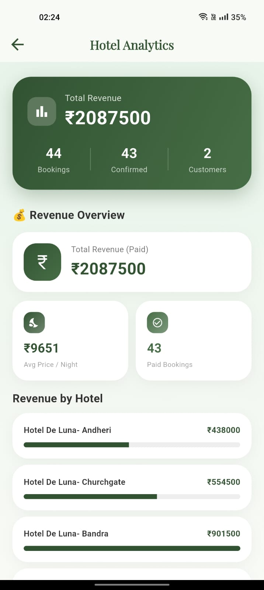    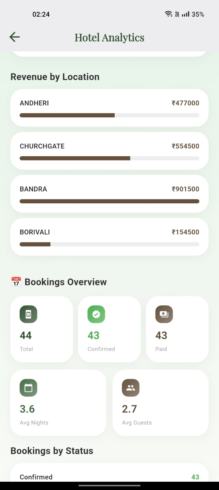
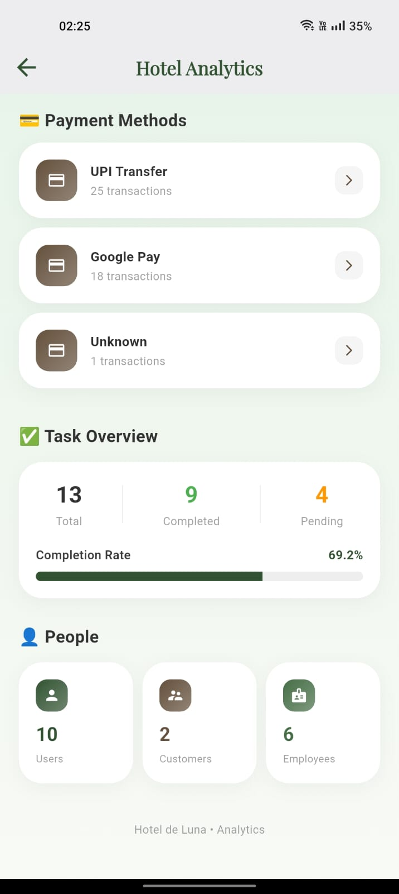

## Database Schema

* **Bookings**- to store customer bookings [CustomerID, RoomID, HotelID, Booked by
(EmployeeID)]
* **Customers**- to store customer information [Name, Email, UserID]
* **Employees**- to store employee records [Name, Permissions, Role, Salary, EmployeeID]
* **Hotels**- storing hotel information [Name, Location, Ratings, Price, Amenities, RoomType,
Images, Description]
* **Payments**- storing payment transactions [Amount, BookingID]
* **Tasks**- storing employee tasks [Task name, EmployeeID, Completed, Description]

